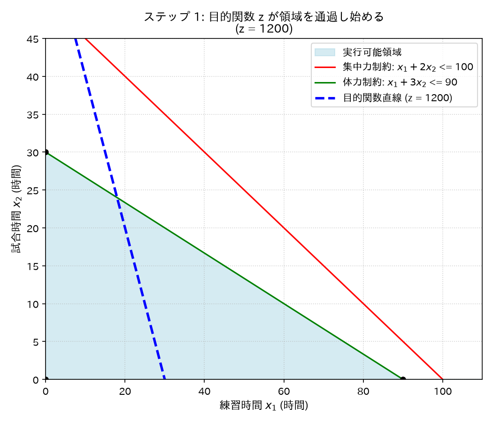
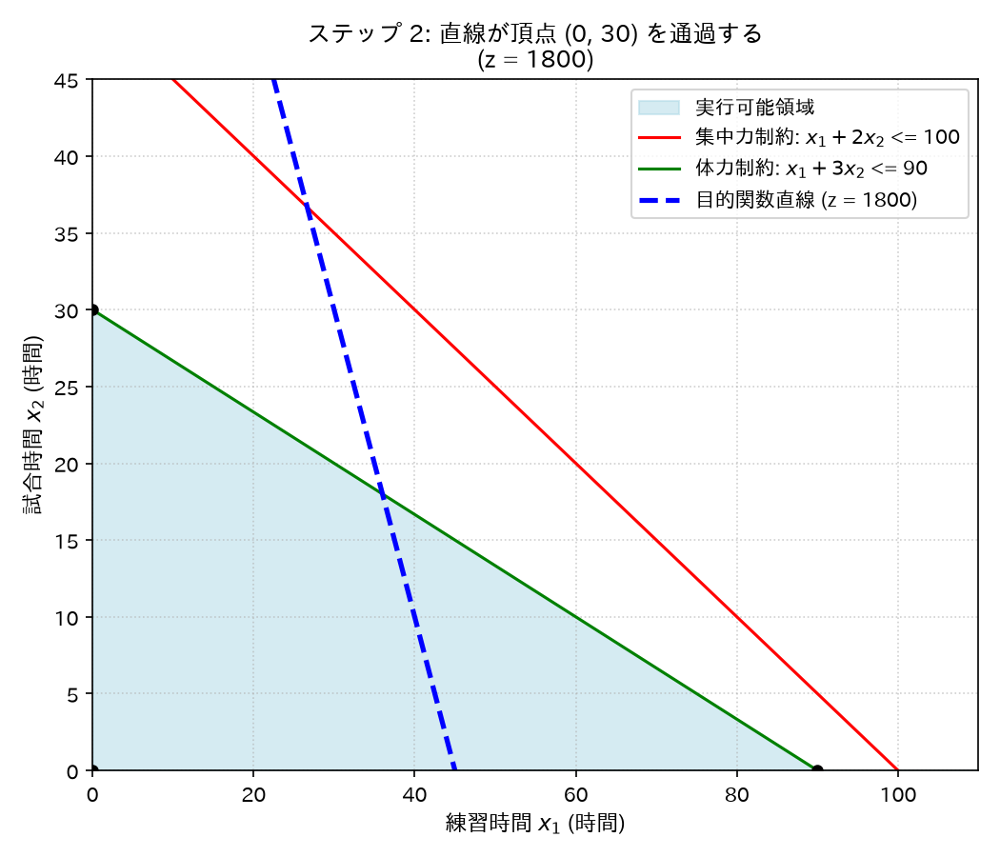
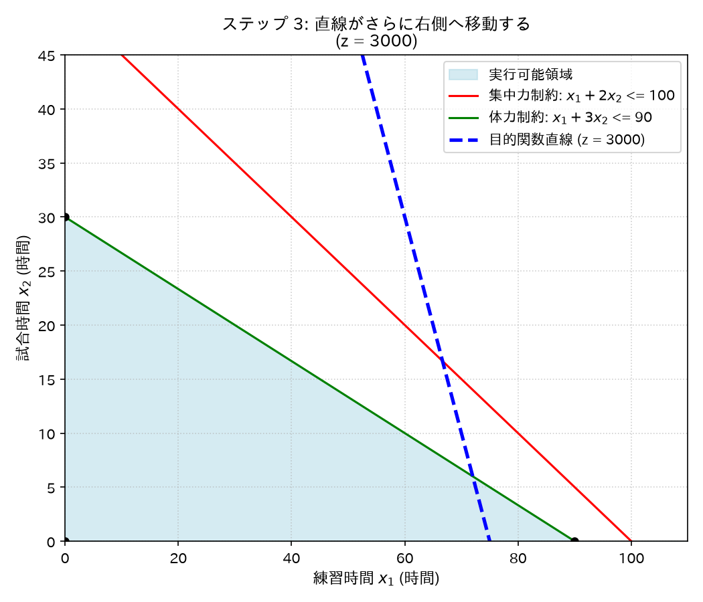
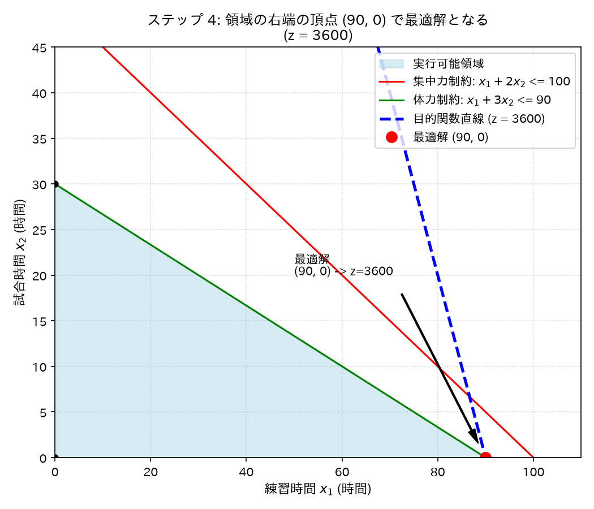

# 身近な例：練習と試合の計画
「練習と試合を何時間ずつ行えば、パフォーマンスが最大になるか？」

---

## 状況設定

| | 練習 | 試合 | 上限 |
| :--- | :---: | :---: | :---: |
| **集中力消費 (pt/h)** | 1 | 2 | 100 pt |
| **体力消費 (pt/h)** | 1 | 3 | 90 pt |
| **向上度 (点/h)** | 40 | 20 | — |

**問:** パフォーマンスを最大にするには、練習と試合を何時間ずつ行えばよいか？

---

## 数理モデルへの定式化

### 決定変数
* $x_1$ : 練習の実施時間 (h)
* $x_2$ : 試合の実施時間 (h)

### 目的関数（最大化）
$$\max \quad z = 40x_1 + 20x_2$$

### 制約条件
$$x_1 + 2x_2 \le 100 \quad \text{（集中力）}$$
$$x_1 + 3x_2 \le 90 \quad \text{（体力）}$$
$$x_1 \ge 0, \quad x_2 \ge 0 \quad \text{（非負制約）}$$

> **→ これが最も基本的な「線形計画問題 (LP)」**

---

# 線形計画問題の図解法：目的関数 $z$ の最適化プロセス

実行可能領域に対して、目的関数の直線 $z = 40x_1 + 20x_2$ を原点側から右上へと平行移動させ、最適な解を探索する。

---

### ステップ 1: 目的関数が領域を通過し始める ($z = 1200$)

* **解説:** 目的関数の直線が実行可能領域の内部を通っている状態。条件は満たしているが、直線はさらに右上へ動かすことができまる。

---

### ステップ 2: 目的関数の直線が領域内を進む ($z = 1800$)

* **解説:** 直線を右上にスライドしていく状態。y軸側の頂点 $(0, 30)$ を通過する時点では、右側の領域にまだ大きな余裕がある。

---

### ステップ 3: さらに右下の頂点方向へシフトする ($z = 3000$)

* **解説:** 直線は最もパフォーマンス効率の良い「練習（$x_1$ 軸）」の方向へと進む。

---

### ステップ 4: 最適解（領域の右端の頂点）に到達する ($z = 3600$)

* **解説:** これ以上直線を動かすと実行可能領域から完全に外れる。2つの制約線が交わる場所ではなく、体力制約が $x_1$ 軸と交わる限界点である **$(90, 0)$** となる。
* **結論:** 練習を **90時間** 行い、試合を **0時間** にするスケジュールが、パフォーマンスの最大値 **$z = 3600$** を達成する最適解である。
* **反省:** パラメータの係数を適切に設定できてないと、このような極端な解がえられる。

